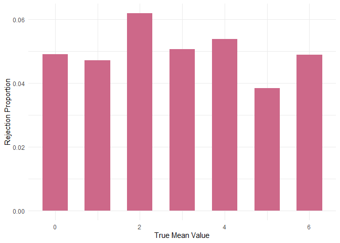
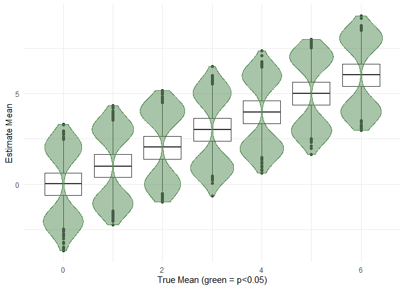

Homework 5
================
Ainsel Levitskaia-Collins, HL2710
2025-11-05

### Problem 1

This problem is unfinished.

``` r
#' repeat_birthdays
#'
#' @param group_size The size of the sample for which birthdays will be selected
#'
#' @returns A boolean value for whether or not there are any overlapping birthdays within the sample
repeat_birthdays = function(group_size) {
  birthday_df <- data.frame(birthdays = sample(1:365, size = group_size, replace = TRUE)) %>% 
    group_by(birthdays) %>% 
    count(birthdays) %>% 
    arrange(desc(n))
  
  overlap <- FALSE
  
  for (i in 1:ncol(birthday_df)) {
    if (pull(birthday_df, n)[[1]] > 1) {
      overlap = TRUE
    }
  }
  
  overlap
}

birthday_sim_df <-
  expand_grid(
    sample_size = 2:5,
    iter = 1:10
  ) %>% 
  mutate(
    estimate_df = map(sample_size, repeat_birthdays)
  ) %>% 
  unnest(estimate_df)
```

### Problem 2

#### Creating the dataframe

Creating a function that

1.  Generates a tibble for the model $x \sim {\sf Normal}[\mu, \sigma]$
    with a set *n* of 30
2.  Runs a t-test on that tibble
3.  Returns that tibble

``` r
normal_sim = function(n = 30, mean, sd) {
  x_vec <- tibble(x = rnorm(n, mean, sd))
  
  x_vec <- x_vec %>% 
    summarise(
      mean_true = mean,
      mean_estimate = mean(x),
      ttest = list(broom::tidy(t.test(x, mu = unique(mean)[1], conf.level = 0.95, alternative = "t")))
      ) %>% 
    unnest(ttest)
  
  x_vec
}
```

Creating a dataframe with 5,000 datasets for each value of $\mu$ = {0,
1, 2, 3, 4, 5, 6} and with a set standard deviation of 5:

``` r
normal_sim_df <-
  expand_grid(
    mean = 0:6,
    sd = 5,
    iter = 1:5000) %>% 
  mutate(
    x = map2(mean, sd, \(mean, sd) normal_sim(mean = mean, sd = sd))
  ) %>% 
  unnest(x)
```

#### Plot 1: comparing power against true mean value

A plot of the proportion of times the null was rejected (y-axis)
compared against the true value of the mean (x-axis).

``` r
plot_normal_sim_power <- normal_sim_df %>% 
  group_by(mean_true) %>% 
  mutate(
    reject = p.value < 0.05,
    reject = case_match(reject,
                        FALSE ~ "reject_no",
                        TRUE ~ "reject_yes")) %>% 
  count(reject) %>% 
  pivot_wider(
    names_from = reject,
    values_from = n
  ) %>% 
  mutate(reject_proportion = reject_yes / (reject_no + reject_yes)) %>% 
  as.data.frame() %>% 
  ggplot(aes(y = reject_proportion, x = mean_true, group = mean_true)) +
  geom_bar(stat = "identity", width = 0.6, fill = "palevioletred3") +
  theme_minimal() +
  ylab("Rejection Proportion") +
  xlab("True Mean Value")

plot_normal_sim_power
```

<!-- -->

There does not appear to be an association between the size of the mean
and the power of the test, as all 7 mean groups have approximately the
same proportion of times that the estimated mean was rejected.

#### Plot 2: comparing the estimated means and the true mean

``` r
normal_sim_rejects <- normal_sim_df %>% 
  filter(p.value < 0.05)

plot_normal_sim_means <- normal_sim_df %>% 
  ggplot(aes(x = mean_true, y = mean_estimate, group = mean_true)) +
  geom_boxplot() +
  geom_violin(data = normal_sim_rejects, fill = "palegreen4", color = "palegreen4", alpha = 0.5) +
  theme_minimal() +
  ylab("Estimate Mean") +
  xlab("True Mean (green = p<0.05)")

plot_normal_sim_means
```

<!-- -->

The sample average of $\hat{\mu}$ across tests for which the null is
rejected is not approximately equal to the true value of $\mu$. I am not
sure why this is.

### Problem 3

#### Preparing the data

Importing the data, tidying the data, and creating a table with the
number of resolved and unresolved homicides for each of the cities
present within the database:

``` r
homicide_raw <- read_csv(file = "./data/homicide-data.csv") %>% 
  janitor::clean_names() %>% 
  mutate(city_state = paste(city, ", ", state),
         resolved = disposition == "Closed by arrest",
         resolved = case_match(resolved,
                               TRUE ~ 1,
                               FALSE ~ 0)) %>% 
  select(city_state, disposition, resolved, everything())

homicide_counts <- homicide_raw %>% 
  group_by(city_state) %>% 
  count(resolved) %>% 
  pivot_wider(
    names_from = resolved,
    values_from = n
  )

knitr::kable(homicide_counts, col.names = c("City, State", "Unresolved Homicide Cases", "Resolved Homicide Cases"))
```

| City, State         | Unresolved Homicide Cases | Resolved Homicide Cases |
|:--------------------|--------------------------:|------------------------:|
| Albuquerque , NM    |                       146 |                     232 |
| Atlanta , GA        |                       373 |                     600 |
| Baltimore , MD      |                      1825 |                    1002 |
| Baton Rouge , LA    |                       196 |                     228 |
| Birmingham , AL     |                       347 |                     453 |
| Boston , MA         |                       310 |                     304 |
| Buffalo , NY        |                       319 |                     202 |
| Charlotte , NC      |                       206 |                     481 |
| Chicago , IL        |                      4073 |                    1462 |
| Cincinnati , OH     |                       309 |                     385 |
| Columbus , OH       |                       575 |                     509 |
| Dallas , TX         |                       754 |                     813 |
| Denver , CO         |                       169 |                     143 |
| Detroit , MI        |                      1482 |                    1037 |
| Durham , NC         |                       101 |                     175 |
| Fort Worth , TX     |                       255 |                     294 |
| Fresno , CA         |                       169 |                     318 |
| Houston , TX        |                      1493 |                    1449 |
| Indianapolis , IN   |                       594 |                     728 |
| Jacksonville , FL   |                       597 |                     571 |
| Kansas City , MO    |                       486 |                     704 |
| Las Vegas , NV      |                       572 |                     809 |
| Long Beach , CA     |                       156 |                     222 |
| Los Angeles , CA    |                      1106 |                    1151 |
| Louisville , KY     |                       261 |                     315 |
| Memphis , TN        |                       483 |                    1031 |
| Miami , FL          |                       450 |                     294 |
| Milwaukee , wI      |                       403 |                     712 |
| Minneapolis , MN    |                       187 |                     179 |
| Nashville , TN      |                       278 |                     489 |
| New Orleans , LA    |                       930 |                     504 |
| New York , NY       |                       243 |                     384 |
| Oakland , CA        |                       508 |                     439 |
| Oklahoma City , OK  |                       326 |                     346 |
| Omaha , NE          |                       169 |                     240 |
| Philadelphia , PA   |                      1360 |                    1677 |
| Phoenix , AZ        |                       504 |                     410 |
| Pittsburgh , PA     |                       337 |                     294 |
| Richmond , VA       |                       113 |                     316 |
| Sacramento , CA     |                       139 |                     237 |
| San Antonio , TX    |                       357 |                     476 |
| San Bernardino , CA |                       170 |                     105 |
| San Diego , CA      |                       175 |                     286 |
| San Francisco , CA  |                       336 |                     327 |
| Savannah , GA       |                       115 |                     131 |
| St. Louis , MO      |                       905 |                     772 |
| Stockton , CA       |                       266 |                     178 |
| Tampa , FL          |                        95 |                     113 |
| Tulsa , AL          |                        NA |                       1 |
| Tulsa , OK          |                       193 |                     390 |
| Washington , DC     |                       589 |                     756 |

The homicide data has 52179 observations of 14 variables, one of which
includes a combined `city_state` variable that has both the city and the
state in which the homicide took place. The data describes where the
homicide took place, the report date, basic demographics of the victim
in the report, and locational data for each homicide.

#### Running `prop.test`

Creating the function that will run `prop.test` for the `homicide_raw`
dataframe:

``` r
homicide_proptest = function(city) {
  city_test <- city
  
  homicide_test <- homicide_raw %>% 
    filter(city_state == city_test)
  
  # in a separate pipeline in order to have r find "resolved"
  test <- prop.test(
      x = sum(pull(homicide_test, resolved)), 
      n = nrow(homicide_test),
      p = NULL,
      conf.level = 0.95) %>% 
    broom::tidy() %>% 
    mutate(city_state = city) %>% 
    select(city_state, estimate, conf.low, conf.high)
  
  test
}
```

Testing the `homicide_proptest` function on Baltimore, MD only:

``` r
homicide_baltimore <- homicide_proptest(city = "Baltimore ,  MD")

homicide_baltimore
```

    ## # A tibble: 1 × 4
    ##   city_state      estimate conf.low conf.high
    ##   <chr>              <dbl>    <dbl>     <dbl>
    ## 1 Baltimore ,  MD    0.354    0.337     0.372

Running the function on all cities within the `homicide_raw` dataframe:

1.  Extracting all unique `city_state` names
2.  Iterating through the unique `city_state` names in the
    `homicide_proptest` function using `purrr::map_dfr`

``` r
homicide_cities <- unique(pull(homicide_raw, city_state))

homicide_estimates <- purrr::map_dfr(homicide_cities, homicide_proptest)

head(homicide_estimates)
```

    ## # A tibble: 6 × 4
    ##   city_state        estimate conf.low conf.high
    ##   <chr>                <dbl>    <dbl>     <dbl>
    ## 1 Albuquerque ,  NM    0.614    0.562     0.663
    ## 2 Atlanta ,  GA        0.617    0.585     0.647
    ## 3 Baltimore ,  MD      0.354    0.337     0.372
    ## 4 Baton Rouge ,  LA    0.538    0.489     0.586
    ## 5 Birmingham ,  AL     0.566    0.531     0.601
    ## 6 Boston ,  MA         0.495    0.455     0.535

#### Plot 1:

- [ ] create a plot that shows the estimates and CIs for each city
- [ ] check out `geom_errorbar` for a way to add error bars based on
  upper and lower limits
- [ ] organize cities according to the proportion of unsolved homicides
